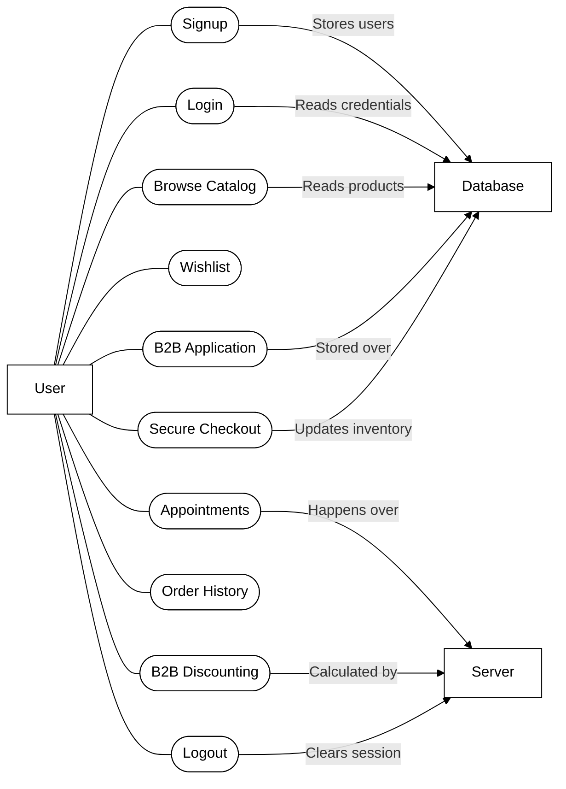
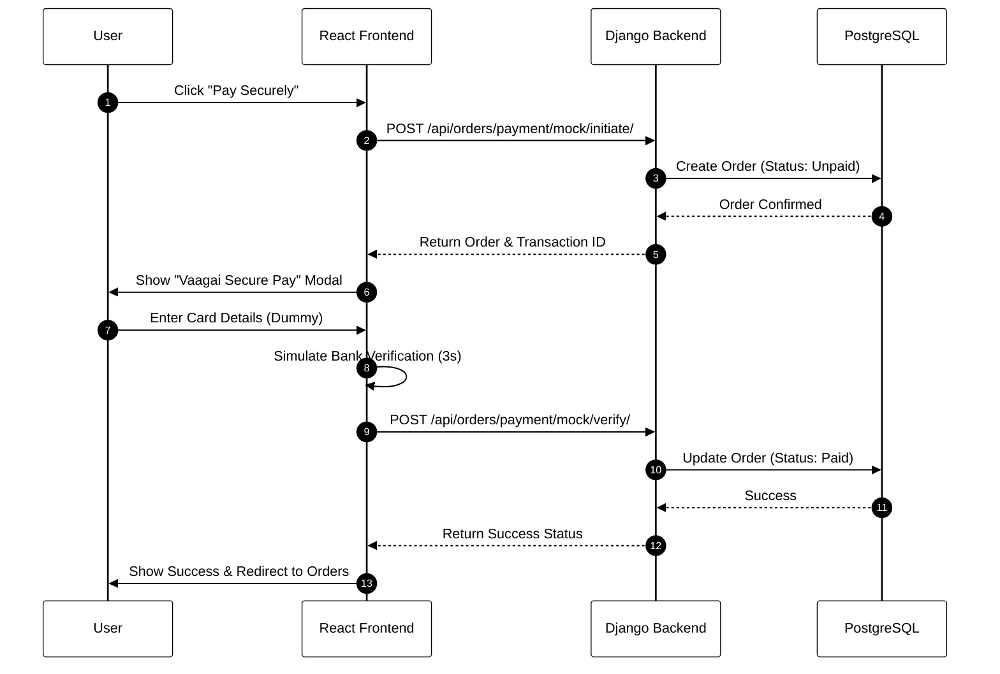
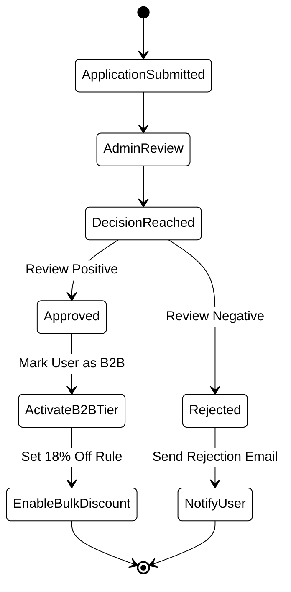
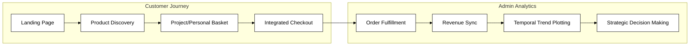
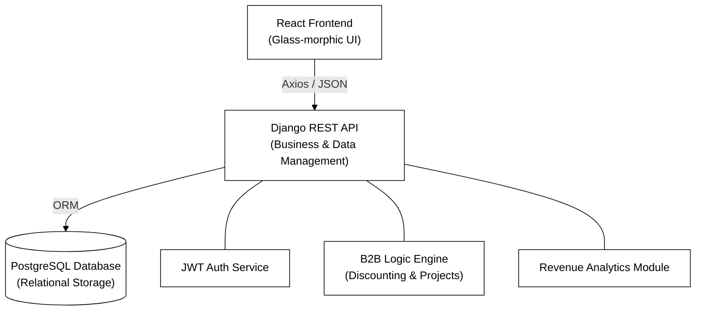

# INTRODUCTION

The Vaagai Doors & Interiors – Data Analytics Driven E-commerce & Customer Engagement Platform is a sophisticated full-stack retail application developed using Python, Django, React, PostgreSQL, and REST API architecture to deliver a seamless and high-end shopping experience. It provides users with a modern, glass-morphic interface to browse artisanal products, manage personal and business (B2B) orders, and experience a secure, integrated digital payment flow. The system supports robust user authentication, field-level data validation for registration, and regional shipping verification to ensure integrity across all transactions. A key highlight is the platform’s dual-stream architecture that handles complex B2B and B2C business logic, allowing for automated project-based discounting, bulk inventory allocation, and specialized client relationship management via the "Vaagai Secure Pay" gateway. For administrative operations, the platform features a comprehensive dashboard with real-time revenue analytics, temporal sales trend visualization, and streamlined order management. This solution is built to demonstrate how a modern eCommerce service can combine visual excellence, dynamic business logic, and reliable architecture into a premium, site-ready digital storefront.

## 1.1 PROBLEM STATEMENT

Traditional retail platforms for high-end interior and artisanal wood products often struggle to provide a unified experience that caters to both individual homeowners and large-scale business projects. Many existing systems lack the sophisticated business logic required to handle automated B2B project discounting and bulk inventory management, leading to manual errors and inconsistent pricing across client tiers. Traditional portals frequently depend on outdated interfaces and lack real-time synchronization between the storefront and administrative analytics, which results in delayed revenue tracking and inefficient stock allocation. Furthermore, security methods in entry-level eCommerce platforms often rely on weak validation protocols, offering no robust regional verification or stable session management for complex transaction lifecycles. These shortcomings create friction in the purchasing process, reduce business engagement, and fail to match the transparency and visual standards demanded by modern luxury clientele. There is a clear need for a data-driven eCommerce solution that integrates high-end design, secure multi-tier authentication, dynamic project-based logic, and real-time analytical synchronization—providing a specialized platform capable of delivering fast, reliable, and premium retail engagement across all sectors.

## 1.2 OBJECTIVE

The primary objective of the Vaagai Doors & Interiors platform is to develop a modern, efficient, and visually stunning retail ecosystem that enables users to browse premium products, manage complex business projects, and complete integrated digital transactions instantly. The system aims to provide a seamless premium shopping experience with real-time revenue updates, secure field-validated registration, and smooth cross-regional accessibility for southern Indian states. It also focuses on enhancing user interaction through features such as dynamic B2B bulk discounting, artisanal quality guarantees, and reliable regional shipping verification. Additionally, the platform empowers administrators with sophisticated data visualization tools to monitor system performance, track daily revenue trends, and handle communication logs, ultimately ensuring stable operations, improved business connectivity, and a cohesive digital storefront for all client tiers.

## 1.3 SCOPE

The scope of the project includes building a complete web-based eCommerce and analytics application designed for seamless high-end retail and user interaction. Users will be able to register through secure field-validated forms, browse artisanal product catalogs, manage both individual and large-scale business orders, and finalize purchases through an integrated secure checkout system. The platform bridges the gap between traditional B2C shopping and complex B2B project management through automated discounting and bulk inventory handling. The backend efficiently manages multi-tier price storage, cart persistence, and regional availability checks for TN, Kerala, and Karnataka. Furthermore, the administrative scope includes a real-time analytics engine for temporal revenue tracking and comprehensive order lifecycle management. This solution enhances the traditional retail experience by bringing visual excellence and data-driven reliability to the digital furniture and interior sector.

# CHAPTER 2 BACKGROUND STUDY

## 2.1 OVERVIEW
This project delivers a full-scale eCommerce and analytics platform engineered to mirror the specialized needs of high-end interior retail. Built using the Django-React stack with RESTful API communication, the system ensures seamless product discovery, dynamic B2B project management, and smooth transaction flows across devices. It supports secure authentication through field-validated registration, allowing users to engage with luxury home solutions with reliability and reduced risk of data entry errors. The platform enables managing artisanal products, complex project baskets, and includes features such as automated bulk discounting, regional shipping validation (TN, Kerala, Karnataka), and real-time revenue tracking. Orders are efficiently structured using PostgreSQL models for users, products, orders, and analytics, ensuring scalable storage and sub-second retrieval. The architecture is designed to offer a clean, glass-morphic interface paired with optimized business logic for uninterrupted performance. Overall, the system consolidates high-end retail needs into a single cohesive environment, providing users with a fast, secure, and modern shopping experience suited for today’s sophisticated digital economy.

## 2.2 EXISTING SYSTEM
Traditional interior retail systems often depend on basic catalog websites, manual quoting processes, or generic eCommerce tools that lack the ability to provide a smooth B2B and B2C integrated experience. Business projects must often switch between multiple channels or rely on slow, inconsistent platforms that cause delays in price estimation, inventory desynchronization, and reduced convenience for bulk orders. Many older systems still rely on simple registration methods without robust field-level validation, increasing the chances of delivery errors, weak data integrity, and unstable session handling for large-scale transactions. Regional shipping is often poorly restricted, with no automated support for specialized courier availability or accurate stock allocation indicators, leading to logistics gaps and a lack of modern features. Without data-driven analytics powered by a real-time backend, administrators cannot enjoy instant revenue visualization or temporal trend tracking. These limitations highlight the need for a centralized, analytics-driven platform that brings together artisanal retail, dynamic business logic, and secure authentication—an exact "Vaagai Doors & Interiors" solution designed to meet the expectations of today’s fast-paced luxury market.

## 2.3 USER CHARACTERISTICS
The platform is designed to serve different user types with specific functionalities and access levels:
*   **B2C Customers (Homeowners)**: Can register and log in using secure validated forms, browse artisanal catalogs, manage personal wishlists, and complete secure digital payments. A premium glass-morphic interface is essential to ensure a high-end experience that matches the product quality.
*   **B2B Clients (Business Projects)**: Have access to specialized project-based order management with automated bulk discounting (e.g., 18% off for 10+ items) and streamlined logistics tracking for large-scale interior installations.
*   **Administrators**: Have full access to a centralized dashboard with real-time revenue analytics, sales trend visualization, and comprehensive order lifecycle management to ensure business stability and growth.

## 2.4 DESIGN AND IMPLEMENTATION CONSTRAINTS

### 2.4.1 Time Constraints
The project followed an Agile development approach with the goal of rapidly delivering a high-quality Minimum Viable Product (MVP). Core functionalities—such as field-validated registration, B2B discounting logic, secure payment flow, and the analytics dashboard—were developed and tested first. Modular backend APIs and reusable React components accelerated development and enabled quick iterations, ensuring faster deployment of essential retail features.

### 2.4.2 Cost and Budget Constraints
To keep costs minimal while maintaining premium performance, the project utilizes open-source technologies including Python, Django, React, and PostgreSQL. During the development phase, local environments were used for database hosting and frontend serving. The system initially focuses on essential high-value features, allowing for gradual scaling and minimizing upfront infrastructural expenses.

### 2.4.3 Security
Security is a top priority. The system uses JWT-based token authentication combined with strict field-level validation to protect user accounts and maintain data integrity. All digital transactions are handled through integrated secure channels, and sensitive user data—such as order details, payment status, and session tokens—is securely stored in a relational PostgreSQL database. The system also implements strict input sanitization and cross-origin resource sharing (CORS) configurations to safeguard against unauthorized access and maintain a reliable retail environment.

### 2.4.4 Scalability
The application is built with scalability in mind. Relational database normalization in PostgreSQL ensures that large-scale product inventories and order logs are handled efficiently. On the frontend, React uses modern state management and lazy loading to optimize performance. The modular architecture enables horizontal scaling of the API layer, ensuring the system can handle increased traffic as the customer base expands across new regions.

# CHAPTER 3 REQUIREMENTS ANALYSIS

## 3.1 FUNCTIONAL REQUIREMENTS

### 3.1.1 User Authentication & Role Management
Users (Admins, B2C Homeowners, and B2B Clients) must be able to securely register, log in, and manage their profiles. The system implements strict field-level validation for full names and 10-digit mobile numbers. Role-based access ensures administrators can manage the artisanal catalog and view revenue analytics, while customers can access personalized order histories and discounted business project baskets. Secure JWT-based session handling protects user data across all interactions.

### 3.1.2 B2B & B2C Business Logic
A core requirement is the platform's dual-stream business logic. The system must automatically distinguish between individual homeowners and business-to-business (B2B) projects, applying specialized bulk discounting (e.g., 18% off for orders of 10+ items) and managing large-scale inventory allocations. The B2B flow must also support project-based order tracking and specialized quoting through the digital interface.

### 3.1.3 Order & Transaction Management
The system must provide an integrated, high-end checkout experience via the "Vaagai Secure Pay" gateway. This includes real-time order status updates (Unpaid, Paid, Shipped, Delivered), regional shipping verification for southern Indian states (Tamil Nadu, Kerala, Karnataka), and automated stock reduction. The transaction flow must support secure verification and immediate payment-to-order reconciliation.

### 3.1.4 Real-Time Data Analytics
Administrators must have access to a sophisticated analytics engine that visualizes real-time revenue and sales trends. The dashboard must support temporal scrolling and dynamic trend analysis to help in business decision-making. All sales data must be synchronized instantly between the storefront and the administrative reporting module.

### 3.1.5 Product & Inventory Management
The platform must allow for the seamless management of an artisanal product catalog. Administrators can upload new designs, update specifications, and adjust multi-tier pricing. The system should automatically reflect stock levels and availability changes to prevent over-ordering during peak business project cycles.

### 3.1.6 Wishlist & Personalization
Users can curate personalized wishlists of artisanal products for future consideration. This allows for persistent interest tracking and helps homeowners and designers plan their interior projects before committing to a final purchase.

### 3.1.7 Appointment Scheduling
The platform must support an appointment booking system for interior design consultations. Users can schedule visits or calls with Vaagai experts, and administrators can manage these requests through a centralized unseen-count notification system to ensure prompt customer engagement.

### 3.1.8 B2B Application & Onboarding
The system includes a specialized onboarding workflow for business clients. Contractors and interior designers can submit B2B applications, which administrators review and approve. Once approved, these accounts are automatically granted access to the project-based bulk discounting logic.

### 3.1.9 Advanced Search & Filtering
To enhance product discovery, the system provides high-performance search and filtering capabilities. Users can filter artisanal products by category, material, and price range, ensuring they find the exact solutions required for their specific home or business project.

## 3.2 NON-FUNCTIONAL REQUIREMENTS

### 3.2.1 Performance
The platform must deliver sub-second API response times for product searches and order placements. Techniques like PostgreSQL query indexing, efficient state management in React, and optimized asset loading will ensure the premium glass-morphic UI remains fluid even during high-traffic revenue spikes or large B2B inventory loads.

### 3.2.2 Usability
The interface must reflect the luxury nature of the artisanal products, utilizing a modern glass-morphic design language. Clean navigation, responsive layouts for all screen sizes, and intuitive actions—such as project-based basket management and analytical chart interaction—must work seamlessly to provide a world-class user experience.

### 3.2.3 Reliability
The system must maintain high data integrity, especially during complex B2B transactions. Relational constraints in PostgreSQL and robust transaction logging will ensure that no order data is lost and that every payment is accurately attributed to the correct user and product inventory.

### 3.2.4 Availability
The service should remain accessible 24/7 to cater to both daytime business project managers and evening retail shoppers. Reliable cloud-based architecture combined with automated database backups will ensure the platform remains stable and resilient against system failures.

# CHAPTER 4 SYSTEM DESIGN

## 4.1 ARCHITECTURAL DESIGN
The architectural design of the Vaagai Doors & Interiors – Data Analytics Driven E-commerce & Customer Engagement Platform outlines the structure and interaction between system components that deliver high-end functionality to end users. This design incorporates various conceptual modeling techniques to visualize system behavior and artisanal interactions:
*   **Use Case Diagram**: Illustrates how different users (B2C Homeowners, B2B Clients, and Admins) interact with the system, such as browsing catalogs, applying for business accounts, managing project baskets, and visualizing revenue trends.
*   **Sequence Diagram**: Outlines the step-by-step interaction flow during key actions like user registration, B2B price calculation, digital payment verification, and administrative dashboard updates.
*   **Activity Diagram**: Represents workflows for essential processes including order fulfillment, regional shipping verification, bulk inventory allocation, and the specialized B2B onboarding lifecycle.
*   **Workflow Diagram**: Visualizes the end-to-end digital journey from landing page exploration and B2B client onboarding to secure transaction finalization and administrative revenue reporting.
*   **Component Diagram**: Illustrates the internal structure and dependencies between the artisanal storefront, the B2B business engine, the administrative analytics module, and the core data services.

### 4.1.2 USE CASE DIAGRAM
As shown in Figure 4.1, the Use Case Diagram outlines the high-level interactions between the user and the platform, mapping core operational flows to the underlying infrastructure. This strategic map defines the artisanal journey—from secure onboarding and B2B application submittal to integrated digital checkout and expert consultations. By visualizing how each action interacts with the primary server and PostgreSQL database, the diagram ensures a coherent understanding of the system's functional architecture and data-driven reliability.

### 4.1.3 SEQUENCE DIAGRAM
As shown in Figure 4.2, the Sequence Diagram outlines the step-by-step logic and chronological interaction flow during a high-stakes action, specifically the "Vaagai Secure Pay" transaction cycle. It details how the React frontend coordinates with the Django backend to initiate an order, display the integrated payment overlay, and verify transaction integrity before marking an order as paid. This precise mapping ensures that data remains consistent across sessions and that no transaction is finalized without multi-tier backend verification.

### 4.1.4 ACTIVITY DIAGRAM
As shown in Figure 4.3, the Activity Diagram represents the logic-driven workflows for essential backend-heavy processes, such as the specialized B2B onboarding lifecycle. It visualizes the decision points and branch logic for business applications—from initial submittal to administrative review and the subsequent activation of project-based bulk discounting. This diagram is crucial for understanding how the system maintains business integrity while providing a streamlined path for professional partners.

### 4.1.5 WORKFLOW DIAGRAM
As shown in Figure 4.4, the Workflow Diagram visualizes the comprehensive end-to-end digital journey within the ecosystem, bridging the gap between customer exploration and administrative data-driven oversight. It highlights the transition from standard artisanal storefront engagement to the backend analytics suite, where daily revenue trends and sales performance are visualized. This bird's-eye view ensures that all system touchpoints—from selection to final revenue reporting—are logically connected.

### 4.1.6 COMPONENT DIAGRAM
As shown in Figure 4.5, the Component Diagram illustrates the internal structure and modular dependencies of the platform. It highlights how the glass-morphic React frontend communicates with the Django REST backend, which in turn orchestrates data exchange between the PostgreSQL storage layer, the B2B business engine, and the administrative analytics module. Defining these boundaries ensures that the platform is built for maintainability and modular scalability as more high-end retail features are integrated.

### 4.1.7 MODULES DESCRIPTION
The system is divided into modules that handle user interaction, business logic, and data processing services:
*   Front-End Development (React)
*   Back-End Development (Django REST)
*   Database Implementation (PostgreSQL)
*   API/Integrations (RESTful Architecture)

#### 4.1.7.1 Front-End Development
The Front-End Development module handles the entire user-facing experience of the eCommerce platform. It ensures smooth navigation, premium visual aesthetics, and real-time interaction responsiveness. Key components include:
*   **UI Screens**: Artisanal product catalog, project-based checkout, user profile dashboard, and the sophisticated administrative analytics screen.
*   **Interactive Elements**: Glass-morphic cards, dynamic filtering sidebars, animated payment verification states, and interactive revenue charts.
*   **State Management**: Synchronizing shopping carts, wishlist updates, B2B pricing reflects, and real-time unseen notification counts.
*   **Responsive Design**: Provides consistent behavior and visual excellence across mobile, tablet, and high-resolution desktop interfaces.

#### 4.1.7.2 Back-End Development
The Back-End Development module powers the core business logic, the analytics engine, and secure authentication mechanisms. It maintains stability, precision, and data flow integrity. Key components include:
*   **Authentication**: Field-validated registration, JWT-based secure session handling, and role-based access control for different client tiers.
*   **Business Engine**: Multi-tier pricing logic, automated B2B project discounting, and regional shipping verification (TN, Kerala, Karnataka).
*   **Core Logic**: Order routing, inventory recalculation, and payment-to-order reconciliation services.
*   **Security Layer**: Strict input validation, CORS protection, and secure data handling against unauthorized access.

#### 4.1.7.3 Database Implementation
The Database Implementation module structures and manages all stored information across products, customers, and transactions. It ensures fast retrieval, scalability, and relational data consistency. Key components include:
*   **User Records**: Validated profile details, role mappings (B2B/B2C), and secure authentication logs.
*   **Product Data**: Artisanal specifications, categorization, multi-tier pricing structures, and inventory levels.
*   **Inventory & Orders**: Transaction IDs, payment states, delivery timelines, and logistics tracking logs.
*   **Analytics Storage**: Temporal revenue data, seasonal trend logs, and administrative activity counters.

#### 4.1.7.4 API/Integrations
The API/Integrations module manages all client-server interactions and external service hooks. It provides secure and reliable endpoints for smooth global operations. Key components include:
*   **REST APIs**: Product discovery, project-based order placement, revenue report generation, and B2B application submittal.
*   **Payment Integration**: Secure hooks for the "Vaagai Secure Pay" gateway, ensuring atomic transaction handling and immediate order status updates.
*   **Logistics Connectors**: Regional verification services for specialized shipping constraints and delivery estimation logic.
*   **Reporting Services**: Integration for generating dynamic analytical reports and historical sales visualizations.

### 4.1.8 DATABASE DESIGN
The database design consists of seven primary relational modules: Accounts, Products, B2B Management, Orders, Cart, Appointments, and Security. Figure 4.6 (Database Structure) elaborates on the full Database Architecture; the User model handles secure JWT-based authentication and role-based access control for both B2C homeowners and verified B2B project clients. The Products module manages artisanal catalogs, hierarchical categories, persistent wishlists, and real-time inventory levels. The B2B module handles the professional onboarding lifecycle and automated project-based bulk discounting logic. The Orders module manages the complete transaction lifecycle, including regional shipping validation specifically for southern Indian states (TN, KL, KA) and secure payment reconciliation. The Cart module provides cross-session persistence, while the Appointments module handles specialized interior design consultations through a notification-driven service. Together, these relational tables form a sophisticated and scalable PostgreSQL architecture that ensures data integrity for high-end retail operations and exhaustive administrative revenue reporting.

# CHAPTER 5 IMPLEMENTATION AND DEPLOYMENT

## 5.1 DEPLOYMENT DETAILS
The deployment architecture for the Vaagai Doors & Interiors platform is a state-of-the-art, cloud-native ecosystem designed for high availability, security, and enterprise-scale performance. Built entirely on the **Microsoft Azure** cloud, the system leverages a distributed approach for maximum resilience and is accessible globally via the official domain.

**Key Infrastructure Components:**
*   **Web Tier**: The backend REST API is hosted on **Azure App Service**, utilizing containerization for consistent environment parity. The React frontend is deployed via **Azure Static Web Apps**, ensuring sub-second global delivery through integrated edge caching and low-latency response times.
*   **Data Persistence**: A fully managed **Azure Database for PostgreSQL (Flexible Server)** handles relational data with high-degree ACID compliance, automated failover capabilities, and point-in-time recovery to ensure zero data loss.
*   **Content Delivery & Security**: All high-definition artisanal media assets are served through **Azure Blob Storage** and accelerated by **Azure Front Door**, providing a premium, low-latency experience. Secrets and environment keys are strictly managed via **Azure Key Vault**, while SSL/TLS termination is handled at the edge for maximum security.
*   **DevOps & Monitoring**: Seamless updates are pushed through **GitHub Actions CI/CD pipelines**, ensuring zero-downtime deployments. Real-time telemetry, performance tracking, and health monitoring are provided by **Azure Application Insights** to maintain peak operational stability.

Together, these services ensure that the platform is not just a digital storefront, but a robust, production-ready environment capable of supporting both artisanal high-end retail and complex B2B project management at scale.

> [!IMPORTANT]
> **LIVE DEPLOYMENT**: Access the production platform at [**https://vaagai.store**](https://vaagai.store)

## 5.2 SYSTEM INTERFACE IMAGES
The following section presents the core system interface images that illustrate how different components of the Vaagai Ecommerce Platform operate in practice. These visuals highlight the user interactions, system workflows, and internal communication pathways that enable features such as product discovery, B2B onboarding, authentication, project management, and real-time analytical updates. Each image provides a structured view of how the client, server, database, and external services collaborate behind the scenes, offering a clear understanding of the system’s functional behaviour.

### 5.2.1 LOGIN PAGE
This screen is the gateway into the system, offering a frictionless sign-in experience via email and password using a clean, glass-morphic layout. By supporting secure JWT-based session handling from the start, it ensures quick and reliable access for both individual homeowners and professional B2B partners. The minimal fields and snappy flow get users authenticated instantly without the usual onboarding drag.

### 5.2.2 REGISTER PAGE
The register page serves as the onboarding hub for homeowners and business professionals, using a streamlined multi-column layout for fast data entry. It includes real-time validation for mobile numbers and a dedicated B2B toggle to automatically route professional partners toward specialized project-based discounting. This ensures every user starts their journey with a secure, verified profile and immediate access to relevant business logic.

### 5.2.3 LANDING PAGE
As the platform's digital flagship, the landing page immerses visitors in the luxury world of bespoke furniture and artisanal doors through high-definition imagery and glass-morphic design. Interactive sections highlight signature collections and the brand's legacy of quality, bridging the gap between casual browsing and professional project consultations. This sophisticated entry point reflects the premium status and technical reliability of the entire Vaagai ecosystem.

### 5.2.4 ADMIN LOGIN PAGE
The Admin Portal provides a secure, lock-protected gateway for authorized personnel to access the management console and real-time revenue analytics. It utilizes JWT authentication to ensure only specialized staff can oversee artisanal collections and mission-critical workflows.
